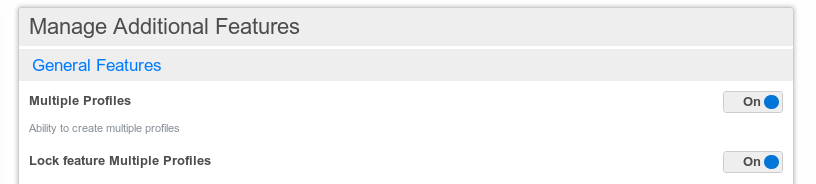

# Managing additional features

Hubzilla comes with a lot of additional features in which each can be enabled or disabled. That admin page gives the admin complete control over the features on their site. They can change the default setting; and they can also permanently enable or disable (lock) a feature for all site members so they don't have a choice in the matter.
You can get to the admin settings via the admin menu or directly via https://hubzilla.dev/admin/features/

Additional features are divided into four groups
- general features
- post composition features
- network and stream features
- post/comment tools

Each feature can be enabled and locked:

How the features can activated or deactivated for the user depends on these two switches of each feature.

| feature activated | feature locked | user experience |
| :-: | :-: | - |
| no | no | feature is by default deactivated and can be activated by the user |
| yes | no | feature is by default activated can be deactivated by the user |
| yes | yes | feature is activated and can't be deactivated by the user |
| no | yes | the feature isn't activated and can't be activated by the user |

If you lock a feature it simply doesn't appear in the additional feature setting to the user no matter if the feature is activated or not.

**TODO** with default setting you mean that if this feature is activated by default? This only works once, right? If an user already changed his additional feature settings and the admin changes the default settings of the features these changes have no effect on the user settings anymore?!?

So by default additional features are not activated and not locked.

For more information on each feature have a look at the corresponding help page.
