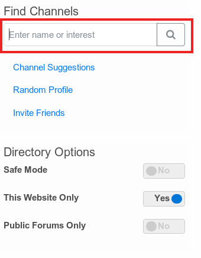

# Advanced Directory Search

In order to use the advanced directory search you have to be at least tech level "4 - export" and must enable the feature at the additional feature page.

The advanced search is integrated in the normal search field on your directory page.



In addition to 'channel name' or 'interest' you can use the following keywords in your search:

* name
* address (channel webaddress)
* locale (typically 'city')
* region (state/territory)
* postcode (or zip code)
* country
* gender
* marital (marital status)
* sexual (sexual preference)
* keywords

Requests are build up by using a keyword followed by an equal sign and the parameter value you are searching for:

```
name=charly
```

Requests may be joined together with 'and', 'or', and 'and not'.
Terms containing spaces must be quoted.

Example:

```
name="charlie brown" and country=canada and not gender=female
```
You don't have to know the full parameter value for a keyword in your search. I.e. if you use the keyword "name=char" all profiles which contain the string "char" in their profile name will be found, regardless of where the string will occur in the profile name. So profiles with the name "charly brown" will be found as well as profiles with a name like "archlinux".

There are many reasons why a match may not return what you're looking for, as many channels do not provide detailed information in their default (public) profile, and many of these fields allow free-text input in several languages - and this may be difficult to match precisely. For instance you may have better results finding somebody in the USA with 'country=u' (along with some odd channels from Deutschland and Bulgaria and Australia) because this could be represented in a profile as US, U.S.A, USA, United States, etc...
