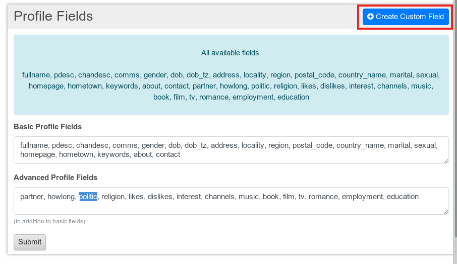
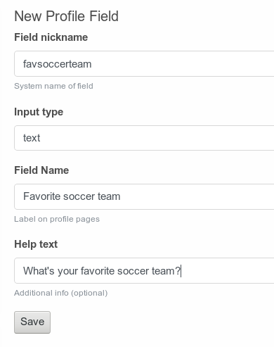
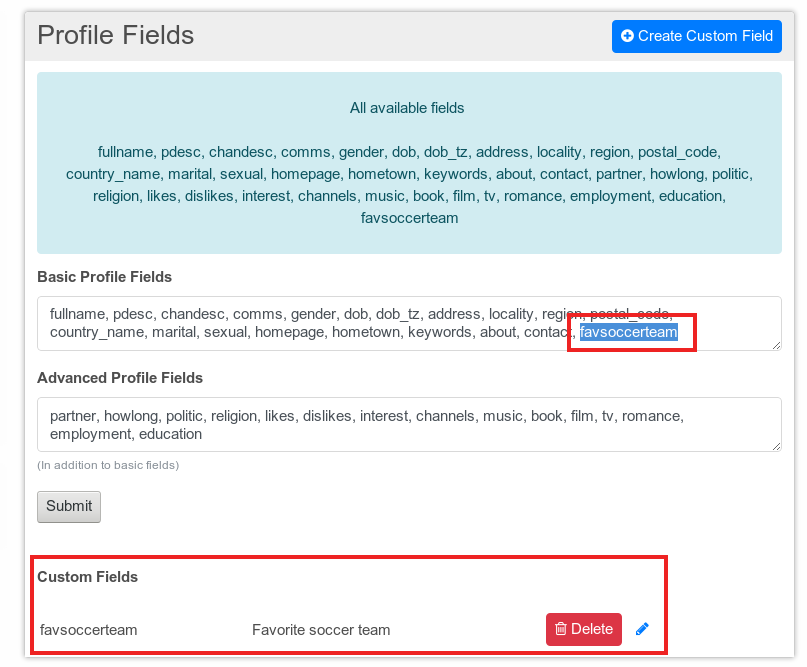

# Advanced profiles and profile fields

Advanced profiles provide the member of the hub a greater number of profile fields which can be used in his profile. Additionally the number of options for some profile fields is increased. I.e. you can choose between 30 different options for your marital status when using advanced profiles instead of nine when the advanced profiles are not enabled.

To use advanced profiles as an user a minimum technical skill level of one is required.

The advanced profiles can be enabled by default or be locked by the hub administrator in the admin feature settings.

## Profile fields

**Changes here can only be made by a hub administrator and will affect the profiles of all users**

An overview of the available profile fields can be seen at the corresponding administrator page which can be found in the admin section under "Profile Fields". You can also get there directly by using the URL https://hubzilla.dev/admin/profs

Here you can see all available profile fields and how they are divided into basic profile fields and advanced profile fields.
If you want an advanced field to become a basic field you just move the field name to the basic profile fields list and vice versa.

Advanced profile fields are only visible if the advanced profile feature is enabled by the member.

## Create custom fields
Additionally to the predefined profile fields a hub administrator can create further profile fields.

A new custom profile field can be created by clicking the "Create Custom Field" button on the profile fields screen.

After clicking the button the screen to create the new profile field is displayed.

Here must enter a field nickname, select an input type and the label of the field name. If you want to you can give some additional information which will be displayed below the profile field when a member edits his profile.

Up to now only the input type "text" can be used.

Once the custom field is created by clicking the "Save" button you will be redirected to the profile fields screen where your new field is listed at the end of the available fields.

To make it available to the members you have to insert it into either the list of the basic profile fields or into the list of the advanced profile fields and submit your changes.

Your new custom field Will appear in the miscellaneous section of your profile.

Editing or deleting of custom profile fields can also be done at the profile fields screen.
