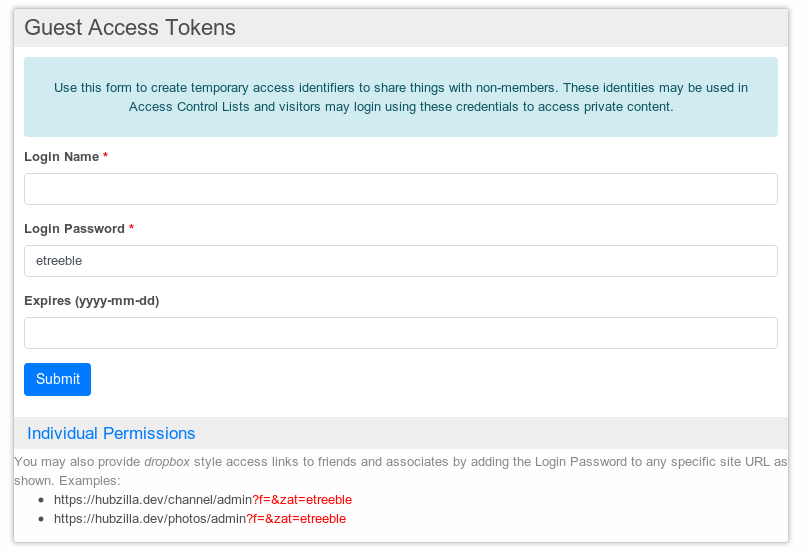

# Guest access token

**tech level 3 is needed**

I want to share with some people who do not have account special content. For exemple I put holiday photo. I don't want that the whole planet know that I was on vacation so only people who have the link would be able to see.

How should I process. I once tryed token or strange things like that but at that time I didnt have any needs. What is the step by step how to.

I just want a link I will send to my contact. Just like nextcloud is able to do in one click. Maybe we can do it in 2 or 3 clicks but it should works the same way

Create a token. Don't worry about token permissions in this case, just set a name and password. Set your photo permissions so that the token name can view it. Send a link to your contact with &zat={token_password} in the link.

The existing tokens are listed at the bottom of the https://hochminuseins.net/settings/tokens page, but it does not indicate which of these are actively used in the ACL of something shared.

There is nothing other than time and determination preventing us from improving this feature. For example, ideally you want a button somewhere when you are assigning the ACL for a new shared item that creates a new guest token for you to use on that item. You could choose to re-use the token or not later. It wouldn't hurt to make a GitHub issue about this and maybe one day someone will work on it.

In its simplest form it's a "dropbox" token and can be used in that form to share somewaht private stuff with family and friends. But you're talking about Hubzilla - we've always tried to encourage people to think outside the box and use simple things in imaginative new ways. @tlapil used access tokens to create a public comment interface a while back.

Is this guest access token always open on all hub ?
Is it possible to give an access to old post (Photos)

I understand that I should first create the token and then create the post.

## Other 
