# Multiple profiles

Multiple profiles is the feature you may want to use if you want to show different "sides of yourself" to different audiences.

This is different to having different channels. Different channels allow for completely different sets of information. You may have a channel for yourself, a channel for your sports team, a channel for your website, or whatever else.

Different profiles apply to only one channel. With these profiles you are able to exactly decide which profile information of your channel you want to share with somebody.

Usually you have at least a "default" profile which can be seen by anybody on the internet and which may contain only limited information about you (or your channel). For example, your default public profile might say "Hello, I'm Fred, and I like laughing". If you want to share more information to your close friends as your real name, your birthday or your hometown you simply create another profile with these information for them.

Any number of profiles may be created containing different information and these may be made visible to certain of your connections/friends. You may create profiles for your family, your buddies or your workmates. You may also choose to use different profile photos for different kind of connections.

## How to create an alternate profile

To create an alternate profile the "Multiple Profile" feature must be enabled by your hub administrator and you must have at least technical skill level 3. Furthermore you must enable the feature by yourself in your additional features. Without this feature enabled you will only be able to use your default profile.

Once you've enabled the multiple profile feature you can create new profiles for your channel. There are different ways to do this:

When you view your profile can click on the edit button you can create a new profile:

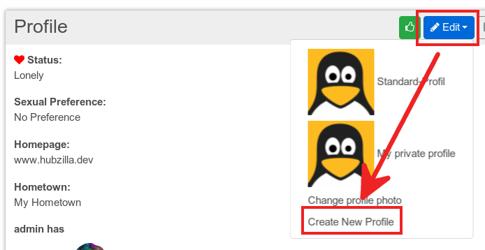

Another possibility to create a new profile is from your edit profile screen:

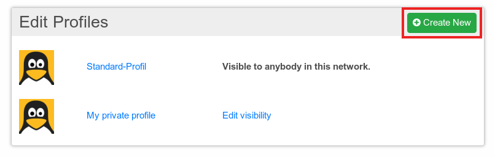

You may also create a "copy" of an existing profile if you only wish to change a few items but don't wish to enter all the information again. To do that, click on the profile you want to clone and choose "Clone this profile" there.

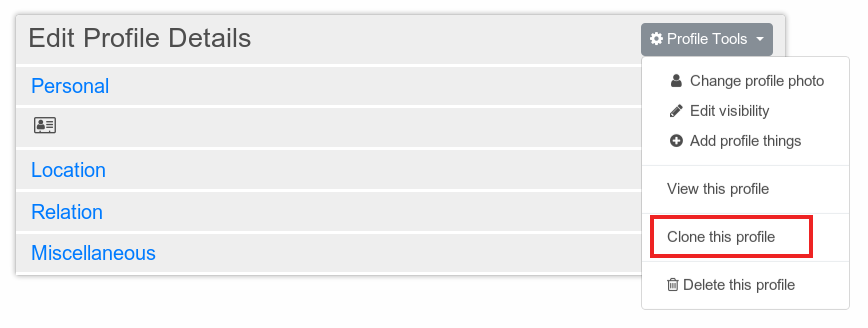

After you've created a new profile you will be taken to the edit profile screen. Editing your new profile is done as described in the members guide. You should consider to use meaningful names for your new profiles so that you don't get confused and accidentally provide the wrong information in the wrong profile. Naming your default profile with 'default profile' or 'standard profile' may avoid problems later.

##  Managing multiple profiles
When you enter your edit profile screen and the multiple profile feature is enabled all of your existing profiles are presented to you

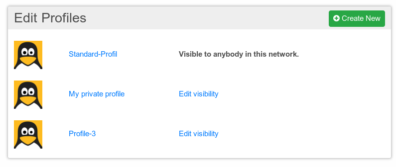

You can also change between your different profiles from the edit profile screen

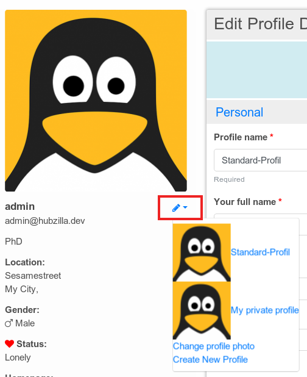

In the list of your profiles, you can also choose the contacts who can see a specific profile. Just click on "Edit visibility" next to the profile in question (only available for the profiles that are not your default profile) and then click on specific connections to add them to or remove them from the group of people who can see this profile.

Once a profile has been selected, when the person views your profile, they will see the private profile you have assigned. If they are not authenticated, they will see your public profile.

Deleting a profile can be done using the profile tools in the profile edit mode. You have to confirm the deletion of your profile.

Your default profile can neither be deleted nor you can change its the visibility.

## Individual profile photos
As you can share different profile information to different audiences you can also use different profile photos. Changing a profile photo for a individual profile is done the same way as if you had not activated the multiple profiles feature.

You can choose between uploading a new photo or select a photo from your photo albums. The only difference is that you have to select a profile for which you want to use the selected profile photo.

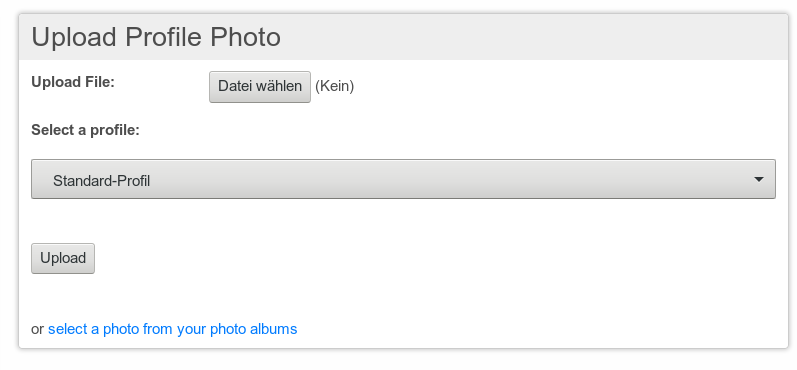

## Visibility of profiles
After you have created multiple profiles you have to assign your connections to them depending on which profile you want to present to each of them. Up to now every connection is assigned to your public default profile.

Changing the visibility can be done in two different ways.

First you can change the visibility separate for each connection. Therefore you start the connection app in your app menu or use the URL http://hubzilla.dev/connections.

Look for the connection you want to set the visible profile for and start to edit this connection:

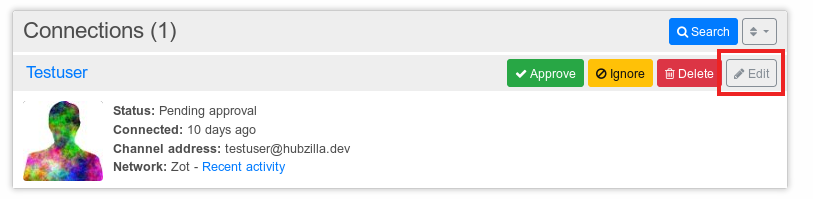

In the edit screen you can choose which profile you would like to display to the connection:

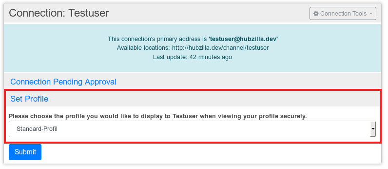

This is a cumbersome approach if you want to set the profile to more than a view connections.

This can easily be done in the profile visibility editor:

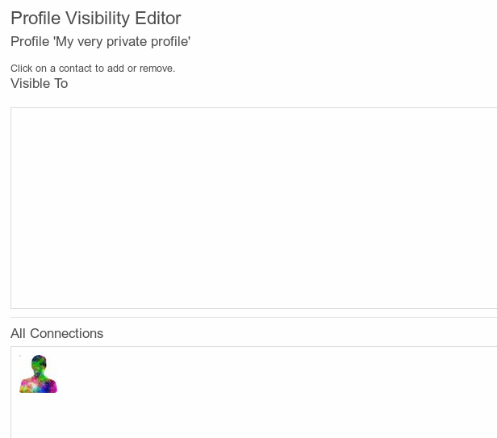

In the profile visibility editor all of your connections are sorted into an "all connections" and a "visible to" area depending on whether the profile is visible to this contact or not. You can simply add or remove a contact to the other field by just clicking on it.

Each connection can only be assigned to one of your profiles. If a connection is already assigned to a profile and you assign the connection to another profile the last assignment will be the valid one and the first assignment will be removed.

You can invoke the visibility editor for a profile on two different ways.

If you are in the edit mode of a profile you can use the profile tools

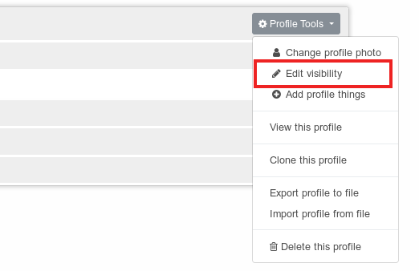

Or you can invoke the editor from the edit profiles overview:

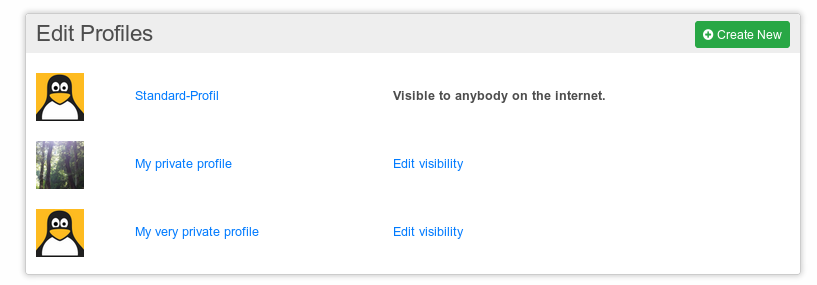

As you can see in the last image the visibility can't be changed for your default profile.

## Profiles as groups
You can use your multiple profiles also in the permission settings just like privacy groups except your default profile. I.e. when setting the permissions of a post you 
