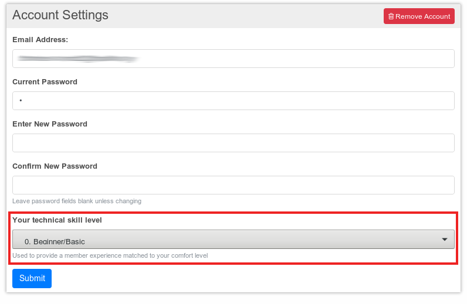

Tech levels (or technical skill levels) are used to provide you a experience corresponding to your technical knowledge. By selecting a technical skill level the number of available options and possibilities are limited so you don't become overwhelmed in Hubzilla. If you get more experienced over time you can change your tech level.

If the tech levels are not visible to you you have to ask your hub administrator to unlock them.

There are six different tech levels available:

| Level | Description |
| :-: | :- |
| 0 | Beginner/Basic |
| 1 | Novice - not skilled but willing to learn |
| 2 | Intermediate - somewhat comfortable |
| 3 | Advanced - very comfortable |
| 4 | Expert - I can write computer code |
| 5 | Wizard - I probably know more than you do |

Depending on your adjusted tech level more and more features become unlocked.

#### 0 - Beginner/Basic
- Privacy Groups

#### 1 - Novice - not skilled but willing to learn
- Advanced Profiles
- Private Notes
- Access Controlled Chatrooms
- Large Photos
- Content Expiration
- Suppress Duplicate Posts/Comments
- Search by Date
- Network Personal Tab
- Affinity Tool
- Suggest Channels
- Community Tagging
- Post Categories
- Emoji Reactions
- Dislike Posts
- Star Posts

#### 2 - Intermediate - somewhat comfortable
- Wiki
- Photo Location
- Permission Groups
- Smart Birthdays
- Event Timezone Selection
- Saved Searches
- Network New Tab
- Saved Folders
- Tag Cloud

#### 3 - Advanced - very comfortable
- Multiple Profiles
- Profile Import/Export
- Web Pages
- Hide Rating
- Navigation Channel Select
- Channel Sources
- Even More Encryption
- Enable Voting Tools
- Connection Filtering
- Guest Access Token

#### 4 - Expert - I can write computer
- Advanced Directory Search
- Advanced Theme and Layout Settings
- Premium Channel
- Custom channel permissions settings

#### 5 - Wizard - I probably know more than you do
