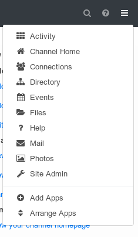
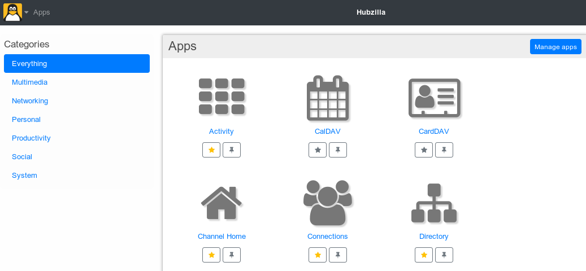
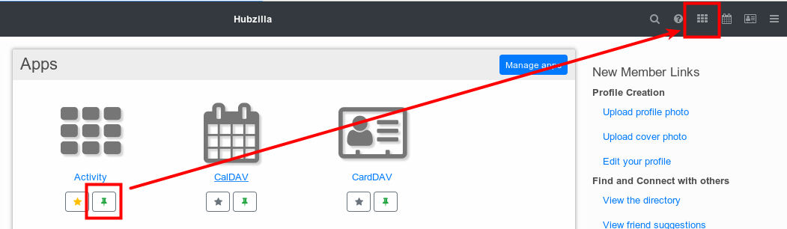
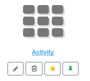
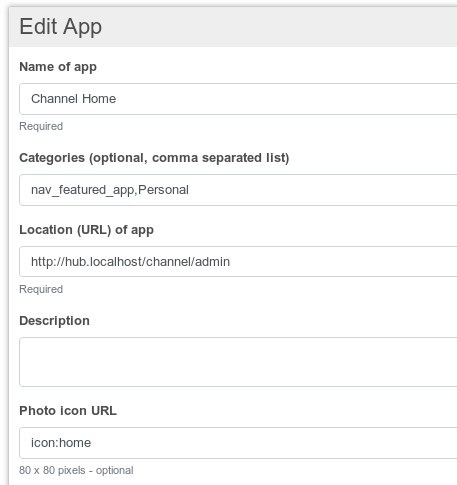
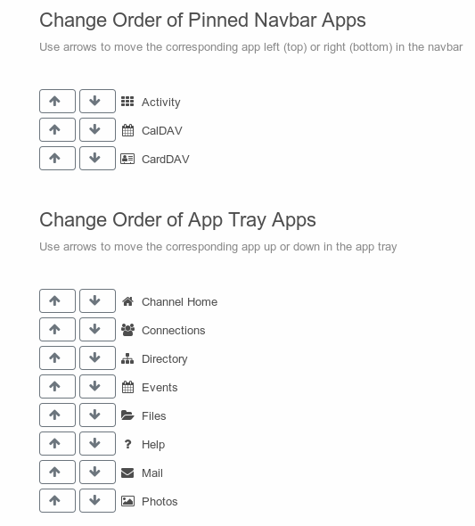
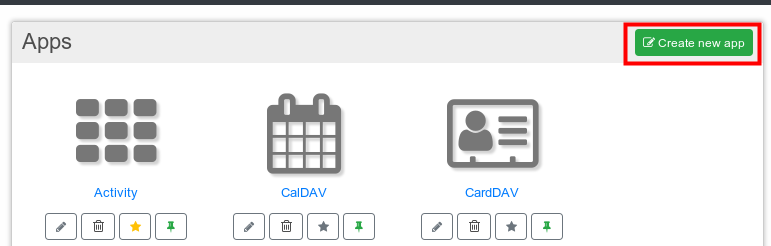
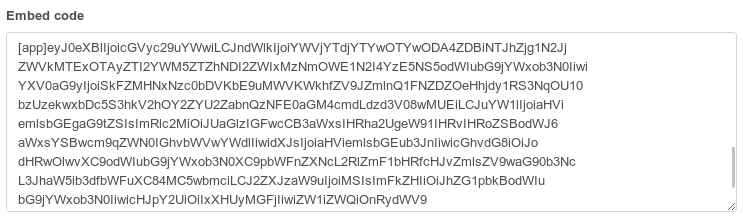
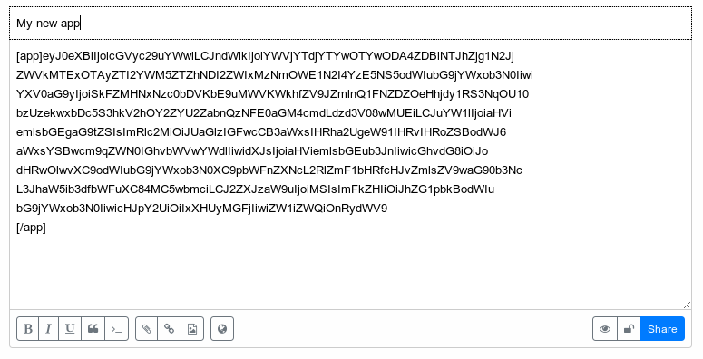
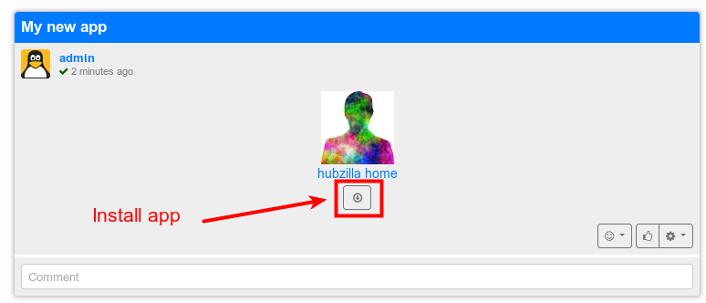

# Apps

Most time when we talk about apps we refer to the Hubzilla components that provide some web service, i.e. "Mail", "Wiki", "Connections" etc. There are core apps which are part of every Hubzilla installation and apps which are provided by plugins.

Which apps are available to your channel, including both core apps and those supplied by plugins, can be seen on your apps page. The apps page can be accessed by the hamburger menu (also called app tray) on the top right of your screen:

At a basic level an app represents nothing more than a link, so you can also simply access the apps by using the corresponding link. Any weblink can potentially be an app (how this can be used is explained at [Create a new app](#create-new-app)).

## Add apps
Which apps are shown in your menu or navbar can be customized by you.
Therefore simply select the "Add Apps" menu. This will lead you to the apps overview page which shows all available apps to your channel. The apps can be sorted by different categories:

This view gives you two possibilities:
- you can add/remove an app to your menu by activating/deactivating the star symbol and
- you can pin an app to the navbar

Furthermore you can manage your apps by pressing the "Manage apps" button.

## Manage apps
When you press the "Manage apps" button from the "Add apps" page each app can now also be edited or deleted.

**Caution: apps will directly be deleted without any conformation required**

When you press the edit button the detail page of the app opens and you can edit individual properties of it:

The following information can be edited:

| Property        |  Description  |
|:-----------------|:-------------|
| Name of the app | The name of the app |
| Categories     | comma separated list of categories; used to help you find your apps more easily; you are not restricted to the existing categories; you can pin the app to the app tray navbar by using the categories "nav_featured_app" and "nav_pinned_app"   |
|Location (URL) of app   | URL of the app. If you omit the "http://" part of the URL the app will redirect you to the /location of your hub. Zot-ID is appended to the URL: ?zid=user@hub.localhost  |
|description   | A short description of the app which will also be shown in the tooltip of the app |
|Photo Icon URL   | where to find the icon for the app; ideally should be 80x80 pixels, default is the rainbow man  |
|Version ID   | Version number of the app  |
|Price of app   | Price of the app will also be shown in the tooltip  |
|Location (URL) to purchase app   | URL where the app can be purchased. Zot-ID is appended to the URL ?zid=user@hub.localhost  |
|Embed code   | Used to embed a link to the app in a post  |

The embed code is generated after editing of the app properties is finished and changes are submitted.
A detail description about how the single properties are used to create a new app can be found [here](#Create-new-apps).

## Arrange apps
You can arrange the order in which the apps should appear in your navbar or app tray by selecting the menu "Arrange Apps" and using the arrows to move an app up or down in the display order.

## Create new app
As already mentioned above an app represents nothing more than a link. So you can simply add links to websites or executable programms to access them as apps. They need not have anything to do with Hubzilla. For example you could have an app for weather reporting or webmail.

To create an app you start from the manage app screen and click on the "Create new app" button:

This will lead you to the same screen as the edit app functionality. Here you can edit your app properties as desired.

After you created an app you can share it with others. Therefore you have to open the edit screen of your app again. After you created your app an additional field is visible on the edit screen, the "Embed code" section.

Just copy the complete embed code and paste it into your posting:

If you edited your app the embed code will be adjusted but only after you submitted your changes. To get the updated embed code you have to open the edit screen again.

## Installing and updating apps
After you submitted your posting it will look like this to you and your followers

If you hover with your mouse over the app icon you can see the description off the app.
As apps simply are links to programms you can click on the app to open the link.

You also can install the app  to your channel by clicking the install button right below the app icon. By installing the app it is listed on your manage app screen where you can pin it to the app tray or the navbar. You also can edit it as the other apps.

To deliver an update of an app to the user you have to publish the embed code again after updating the app.
The post looks almost the same as post of the newly published app (maybe the tooltip has changed). What is different is that the install button now becomes an update button. By clicking it the already installed app will be updated to the version the app creator has published.

**Caution: If you made any changes to the installed app, these changes will be overwritten by the update!**

The user can install old apps as he still has the embed code of the app.
