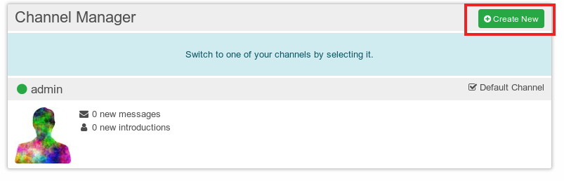
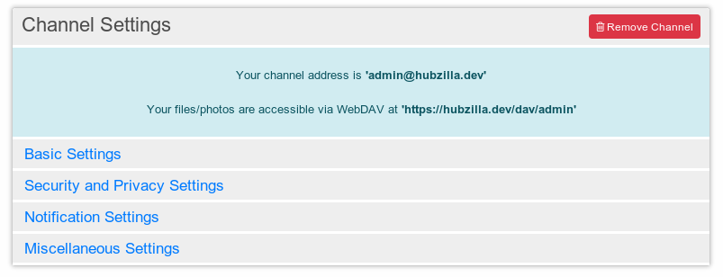
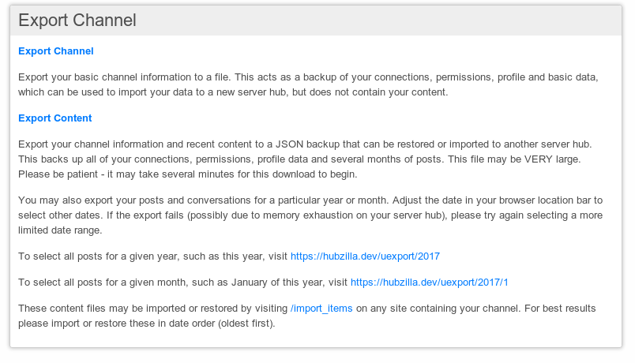

# Channels

Channels are simply collections of content stored in one place. A channel can represent anything. It could represent you, a website, a forum, photo albums, anything.

For most people, their first channel will be "Me, on the internet", a channel that represents themselves.

The most important features for a channel that represents "me" are:
- Secure and private "spam free" communications
- Identity and "single-sign-on" across the entire network
- Privacy controls and permissions which extend to the entire network
- Directory services (like a phone book)

This help will show you everything you need to know about channels. From creating over cloning to removing.

## How to create a channel
After you finished your registration on a hub you will be presented with the "Create Channel" screen to create your fist channel on this hub.

If you already have a channel and want more you can create another one by using the channel manager or using the URL https://yourdomainadress/new_channel. The channel manager can be found in your menu.

The number of channels you can have maybe limited due to hub.

Normally, your first channel will be one that represents you - so using your own name (or pseudonym) as the channel name is a good idea. The channel name should be thought of as a title, or brief description of your channel. The "choose a short nickname" box is similar to a "username" field. We will use whatever you enter here to create a channel address, which other people will use to connect to you, and you will use to log in to other sites. This looks like an email address, and takes the form nickname@siteyouregisteredat.xyz

**Important: changing the channel nickname isn't possible after creation. The name can be changed**

Before finishing your channel creation you should adjust your so called permission role in the channel role and privacy settings. Each permission role defines a different level of privacy as who can see your shared photos, who can see that you are online or if your profile is published in the global user directory etc.

If you are unsure what to choose here start with "Social - Private". The privacy settings can be changed later.

More on security and privacy and permission roles is written below.

Importing an existing channel isn't important for creating your first channel so it is explained below.

## Explanation of Channel settings
After you've created a channel you will directly be taken to the channel settings. You can also adjust the channel settings later by calling up the channel settings over the menu or directly by using the url https://hubzilla.dev/settings/channel.

At the top of the channel settings screen you can see your channel address and the address you can use to access your files and photos via WebDAV (see [personal cloud storate](./personal_cloud_storage.md)).

### Basic settings
Here you can change channel name but remember that the channel address is not changed.

Further settings:
- Timezone
- Post locations
- Default file and photo upload folder.

In the basic settings you have the possibility to mark your channel as an adult channel of it frequently or regularly publishes adult content. Adult channels are hidden in the channel directory when the "safe mode" is activated.

Posts appear collapsed with "possible adult content" warning in public stream.

Even if you marked your channel as an adult channel please tag any adult material and/or nudity with #NSFW.

### Security and privacy settings
When you create a channel we allow you to select different 'roles' for that channel. These create an entire family of permissions and privacy settings that are appropriate for that role. Typical roles are "Social - mostly public", "Social - mostly private", "Forum - public" and many others. These bring a level of simplicity to managing permissions. Just choose a role and appropriate permissions are automatically applied:

- Social Networking (the channel is a typical social networking profile)
  - Social - Mostly Public
  - Social - Restricted
  - Social - Private
- Community Forum (The channel is a typical forum)
  - Forum - Mostly Public
  - Forum - Restricted
  - Forum - Private
- Feed Republish (similar to Social - Mostly Public, but tailored for RSS feed sources)
  - Feed - Mostly Public
  - Feed - Restricted
- Special Purpose
  - Special - Celebrity/Soapbox
  - Special - Group Repository (A public forum which allows members to post files/photos/webpages.)
- Other
  - Custom/Expert Mode

If none of the roles meets your requirements you can set all the privacy and permission manually to suit your specific needs in the 'Custom/Expert mode'.

Detailed information about permission roles can be found [here](./permission_roles.md).

Furthermore you can set or unset the following permissions:
- Allow us to suggest you as a potential friend to new members
- Allow others to tag your posts

Another setting is "Expire other channel content after this many days". Here you can set after how many days content imported from channels you are connected with will expire and therefore be deleted.

Anything that is visible on your channel page will not expire. For content on your network page, we'll keep an entire conversation if  
- you wrote it
- you starred something in it
- you filed something in it
- you commented or reacted on it somehow (this was added recently)

If you don't want other contents to expire you simply set expiration limit to zero.

This limit is also a global setting for your hub which can only be set by your hub administrator. The limit of your hub always prevails your individual limit. I.e. if you set your limit to 20 days and your hub has a limit of 10 days the content from your connected channels will expire after 10 days. Comments from connected channels to your posts is not included.

### Notification settings
Notifications are divided up into three types:
- by default post a status message when
- send a notification email when
- show visual notifications including

Adjust how much and for what kind of events you want a notification. The settings are self explanatory.

### Miscellaneous settings
Up to now you can only set whether to start your calendar week on Monday.

## How to connect to other channels
For details about how to connect to other channels please read the details about [connections](./connections).

## How to export a channel
Channels and the contents of channels can be exported by hand.

These export files can be used as a simple backup of your channel information or content or to move or clone your channel to another hub which is the most common use case for exporting your channel.

There are three different options to export your channel. You can:
1. export your basic channel information:

  This includes your connections, permissions, profile and basic data as settings and add-on settings. But most important it includes your channel identity information (including the "channel_prvkey") private key required to claim ownership of the channel.

2. export your complete channel information and recent content:

  This type of exports consists of two parts: your data section and your "posting history".
  The data section includes your channel, connections, configuration, permissions, apps, chatrooms, events, webpages, mail and wikis. Furthermore it exports a "few" months of post. Actually a "few" means six months but this can change in future because this feature is highly dependent on how much memory is available.

3. export content for particular years/months:

  The content export contains years/months of posts and stored files (including photos). It doesn't include any channel identity information. A detailed description on how this is done can be found on the export screen.

  Be careful not to export to much content into a single file. If you attempt to import too much content at a time the application will white screen. How much you can import without a white screen is primarily a function of total file size.

The export file will contain your information in JSON-format.

**The complete export may be VERY large and it can take several minutes for this download to begin.**

An export of your channel can also be used as a backup in case your channel is damaged.
But: Without knowing what exactly is damaged there is no guarantee that importing an export-file will automatically repair your broken channel.

Best practice is to backup your content regularly if you don't have an existing clone. Once a month backup the channel data and the content from the previous month.

**The following method is not recommend to technical novices**  
This can be done from the Zot API using a simple script and could be automated. You can also make monthly snapshots of your files/photos but this currently requires some manual fiddling. The metadata is available from the Zot API, but the actual file contents should probably be synced through the 'snap' module which provides raw access to your cloud storage via WebDAV.  

## Importing channels and channel contents
When talking about importing one has to distinguish between importing channels and importing channel contents.

### Import channel
The channel import is a bit hidden in the UI. In order to import a channel to a hub you have to create a new channel using the channel manager.

You can choose if you want to import your channel from an export file or if you want to import your channel from the old hub via network. When cloning over the network, only the basic channel information is cloned (everything except posts and files). I

Wether you can import everything of your channel at once depends on how much you already posted. If you post "lightly" or "moderately" you can get away with migrating a year of content at a time. If you post frequently or "heavily" you will run into errors trying to import more than a few months. Existing files/photos can only be migrated by plugin currently.

### Import channel content
For importing only channel content there is no menu in the interface. You have to use the URL https://hubzilla.dev/import_items

By this way you can import content to another hub where you already have a clone. As already told above how much content you can migrate at a time depends on how much you posted.

## How to clone a channel
Channels can have clones associated with separate and otherwise unrelated accounts on independent hubs. Communications shared with a channel are synchronized among the channel clones, allowing a channel to send and receive messages and access shared content from multiple hubs.

To clone a channel you first have to export your channel and then import it on the other hub.
Is it sufficient to export the basic channel information to create the clone. Hubzilla will use whatever information is available at the time and sync it. This may not be all the channel information or posts. Changes that are made after the clone is created will sync. Changes made before the clone was created may not synchronise unless you take additional steps to import the posts and files/photos.  

Best practice would be to create a clone very soon after creating a channel. This way files and photos will be synced from the start. Syncing files and photos afterwards is possible but may require a bit of hand holding and is not very seamless.

When importing you have the possibility to make the imported channel the new primary channel.
You can have more than one clone.

To read more about the possibilities and background of clones see the concepts.

## What is my primary channel?
It's your "preferred location". Best to provide an example here. Let's say I don't have a channel clone, but I do routine backups to a thumb drive. This thumb drive contains my identity and friends, but *not* all of my content. If my site goes down "temporarily" I can use this thumb drive and load it on another site and stay connected with my friends, but I still want my "home URL" to point to the site with all my content, not the new site which has none. Your primary URL is the one that people will visit if they click your photo or name.

## How to move a channel to another server
Hubzilla 2.x or later allows you to move a channel to another server. It currently works by making the original channel "read-only". This way you can still migrate files and photos and content if you have a large quantity of any of these. You cannot use the original channel to post new content and any later changes will not be synced.

To move a channel simply make an export of your desired channel and import the channel to your new hub or use the import via network. Before you start to import you can enable the option to move the channel. Thereby your old channel and all clones of it will be disabled.

It is not possible to preserve connections on other networks from other locations currently.

## Remove a channel
To remove a channel you can simply call http://yourhubadress/removeme or press the "Remove Channel"-button in your channel settings:

**Before removing a channel be sure you have the activated the right channel in the case that you have more than one channel on this hub**

To remove your channel you have to verify this by entering your valid hub password.

**Removing your channel is irreversible.**

If you thought about exporting your channel, removing it an importing it again later this can not be done without admin assistance to remove the channel record in the database, which should not be attempted if you have Diaspora connections.

If your channel has no clones it will be removed completely from the grid. After deleting your channel it will automatically disappear from your connections without any notification. Your posts will also be deleted not only on your own hub but also on your federated hubs. This is limited to the grid (Hubzilla) and can take several days to complete.

Deleting posts and content federated to other networks than Hubzilla is not supported.

If you have clones only the channel on your current hub is removed. All of your posts on the channel you are about to delete  will be removed from that server. This is a "local remove" and should not affect any other clones.

If you want to remove your channel completely including it's clones you have to activate this before removing. The result is the same as if you had only one channel without clones.

In the case you deleted your primary channel and didn't provide a new primary, other sites will randomly choose one of your remaining channels and make it primary until they get further direction from you as to your preferred primary location.
