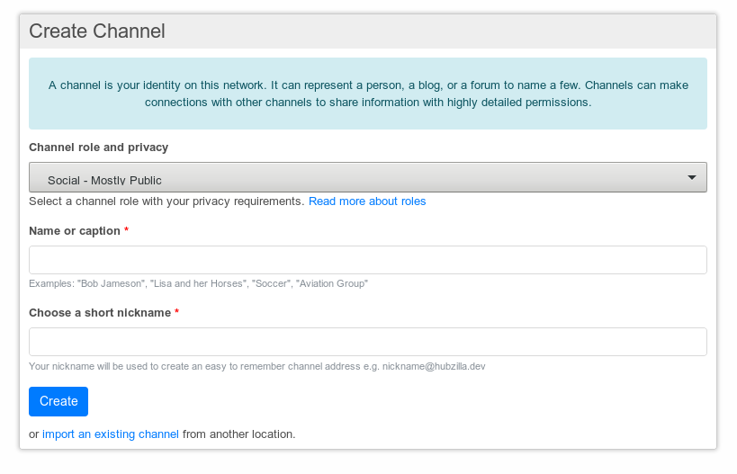
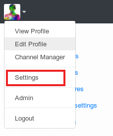
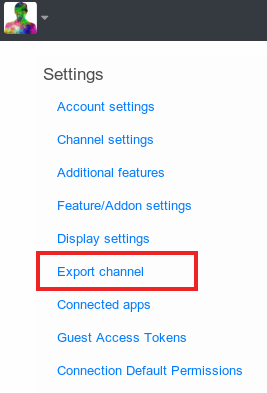
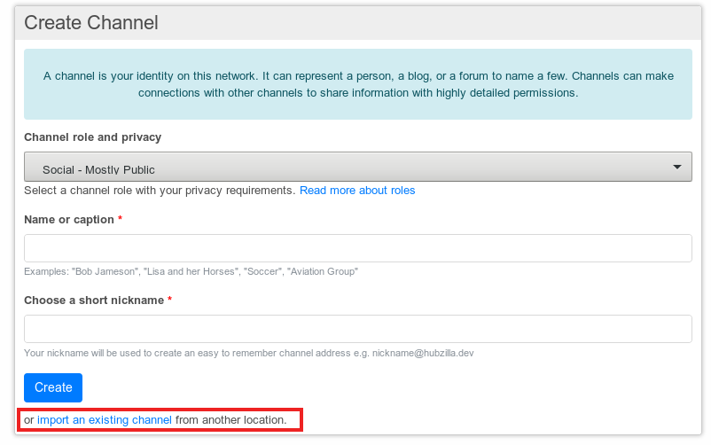
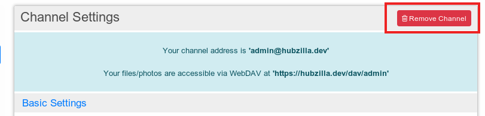
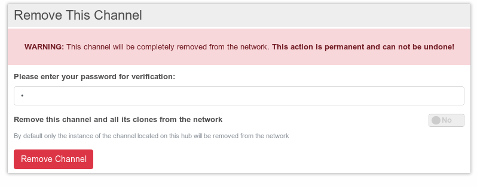

# Channels
Channels are simply collections of content stored in one place. A channel can represent anything. It could represent you, a website, a forum, photo albums, anything.

For most people, their first channel will be "Me, on the internet", a channel that represents themselves.

The most important features for a channel that represents "me" are:
- Secure and private "spam free" communications
- Identity and "single-sign-on" across the entire network
- Privacy controls and permissions which extend to the entire network
- Directory services (like a phone book)

This help will show you everything you need to know about channels. From creating over cloning to removing.

## How to create a channel
After you finished your registration on a hub you will be presented with the "Create Channel" screen to create your fist channel on this hub.

If you already have a channel and want more you can create another one by using the channel manager or using the URL https://yourdomainadress/new_channel

The number of channels you can have maybe limited due to hub.

Normally, your first channel will be one that represents you - so using your own name (or pseudonym) as the channel name is a good idea. The channel name should be thought of as a title, or brief description of your channel. The "choose a short nickname" box is similar to a "username" field. We will use whatever you enter here to create a channel address, which other people will use to connect to you, and you will use to log in to other sites. This looks like an email address, and takes the form nickname@siteyouregisteredat.xyz

**Important: changing the channel nickname isn't possible after creation. The name can be changed**

Before finishing your channel creation you should adjust your so called permission role in the channel role and privacy settings. Each permission role defines a different level of privacy as who can see your shared photos, who can see that you are online or if your profile is published in the global user directory etc.

If you are unsure what to choose here start with "Social - Private". The privacy settings can be changed later.
More on security and privacy and permission roles is written below.

Importing an existing channel isn't important for creating your first channel so it is explained below.

## Explanation of Channel settings
After you've created a channel you will directly be taken to the channel settings. You can also adjust the channel settings later by calling up the channel settings over the menu or directly by using the url https://hubzilla.dev/settings/channel.

At the top of the channel settings screen you can see your channel address and the address you can use to access your files and photos via WebDAV (see [personal cloud storate](./personal_cloud_storage.md)).

### Basic settings
Here you can change channel name but remember that the channel address is not changed.

Further settings:
- Timezone
- Post locations
- Default file and photo upload folder.

In the basic settings you have the possibility to mark your channel as an adult channel of it frequently or regularly publishes adult content. Adult channels are hidden in the channel directory when the "safe mode" is activated.

Posts appear collapsed with "possible adult content" warning in public stream.

Even if you marked your channel as an adult channel please tag any adult material and/or nudity with #NSFW.

### Security and privacy settings
When you create a channel we allow you to select different 'roles' for that channel. These create an entire family of permissions and privacy settings that are appropriate for that role. Typical roles are "Social - mostly public", "Social - mostly private", "Forum - public" and many others. These bring a level of simplicity to managing permissions. Just choose a role and appropriate permissions are automatically applied:

- Social
  - Mostly Public

    The channel is a typical social networking profile. By default posts and published items are public, but one can over-ride this when creating the item and restrict it. You are listed in the directory. Your online presence and connections are visible to others.

  - Restricted

    By default all posts and published items are sent to your 'Friends' privacy group and not made public. New friends are added to this privacy group. You can over-ride this and create a public post or published item if you desire. You are listed in the directory. Your online presence (for chat) and your connections (friends) are visible to your profile viewers.

  - Private

    By default all posts and published items are sent to your 'Friends' privacy group. New friends are added to this privacy group. You can over-ride this and create a public post or public item if you desire. You are NOT listed in the directory. Only your connections can see your other connections. Your online presence is hidden.
- Forum
  - Mostly Public

    The channel is a typical forum. By default posts and published items are public. Members may post by @mention+ or wall-to-wall post. Posting photos and other published items is blocked. The channel is visible in the directory. Members are added automatically.
  - Restricted

    By default all posts and published items are sent to the channel's 'Friends' privacy group. New friends are added to this privacy group. Members may post by @mention+ or wall-to-wall post, but posts and replies may also be seen by other recipients of the top-level post who are not members. The channel is visible in the directory. Members must be manually added by the forum owner.

  - Private

    By default all posts and published items are sent to your 'Friends' privacy group. New friends are added to this privacy group. The owner can over-ride this and create a public post or public item if desired. Members cannot. You are NOT listed in the directory. Only your connections can see your other connections. Your online presence is hidden. Members must be manually added by the forum owner. Posting by @mention+ is disabled. Posts can only be made via wall-to-wall posts, and sent to members of the 'Friends' privacy group. They are not publicly visible.  
- Feed
  - Public

    Similar to Social - Mostly Public, but tailored for RSS feed sources. Items may be freely republished and sourced. Online presence is meaningless, therefore hidden. New connections are automatically approved.  
  - Restricted

    Not listed in directory. Online presence is meaningless, therefore hidden. Feed is published only to members of the 'Friends' privacy group. New connections are automatically added to this privacy group. Members must be manually approved by the channel owner.
- Special
  - Celebrity/Soapbox

    Listed in directory. Communications are by default public. Online presence is hidden. No commenting or feedback of any form is allowed, though connections have the ability to "like" your profile.
  - Group Repository

    A public forum which allows members to post files/photos/webpages.
- Custom/Expert Mode

If none of the roles meets your requirements you can set all the privacy and permission manually to suit your specific needs in the 'Custom/Expert mode'.

Detailed information about the expert mode and permission roles can be found [here](./permission_roles.md).

Furthermore you can set or unset the following permissions:
- Allow us to suggest you as a potential friend to new members
- Allow others to tag your posts

**TODO**
**- Expire other channel content after this many days** what's the meaning of this

### Notification settings
Notifications are divided up into three types:
- by default post a status message when
- send a notification email when
- show visual notifications including

Adjust how much and for what kind of events you want a notification. The settings are self explanatory.

### Miscellaneous settings
Up to now you can only set whether to start your calendar week on monday.

## How to connect to other channels
For details about how to connect to other channels please read the details about connections.

## How to export a channel
Channels and the contents of channels can be exported by hand.

These export files can be used as a simple backup of your channel information or content or to move or clone your channel to another hub.

There are two different options to export your channel. You can
1. export your basic channel information
2. export your channel information and recent content

The export file will contain your information in JSON-format.

The basic channel information contain a backup of your
- connections
- permissions
- profile and basic data

The extended export contains
- connections
- permissions
- profile and basic data
- months of posts

**The extended export may be VERY large and it can take several minutes for this download to begin.**

You can also restrict your extended export to a particular year or month. A detailed description on how this is done can be found on the export screen.

**TODO**
**open questions**
- are only posts exported? what about the pictures containing these posts?
- are the complete settings exported? what about addons?
- is a channel export useful as a backup?
- is the export of a particular year/month only contents? Can this be imported on a different hub?

## Importing channels and channel contents
When talking about importing one has to distinguish between importing channels and importing channel contents.

### Import channel
The channel import is a bit hidden in the UI. In order to import a channel to a hub you have to create a new channel using the channel manager.

You can choose if you want to import your channel from an export file or if you want to import your channel from the old hub via network.

**TODO**
**Questions**
- what is the difference in importing via file or importing via network?

### Import channel contents
**TODO**

https://hubzilla.dev/import_items
## How to clone a channel
Channels can have clones associated with separate and otherwise unrelated accounts on independent hubs. Communications shared with a channel are synchronized among the channel clones, allowing a channel to send and receive messages and access shared content from multiple hubs.

To clone a channel you first have to export your channel and then import it on the other hub. When importing you have the possibility to make the imported channel the new primary channel.

You can have more than one clone.

To read more about the possibilities and background of clones see the concepts.

## How to move a channel to another server
**TODO**

## Remove a channel
To remove a channel you can simply call http://yourhubadress/removeme or press the "Remove Channel"-button in your channel settings:

**Before removing a channel be sure you have the activated the right one in the case that you have more than one channel on this hub**

To remove your channel you have to verify this by entering your valid hub password.

**Removing your channel is irreversible.**

By default only the channel on your current hub is removed. Clones of your channel on other hubs are not removed. If you want to remove your channel completely including it's clones you have to activate this before removing.

**TODO**
Questions:
I have only one channel:
- will my channel automatically disappear from my connections?
- will there be a notification to the connections of my channel?
- what happens to my posts?
- what happens to my data, database entries?
- what happens if I export my channel, remove it and import it again on the same server?

I have clones
- same questions if i remove all clones as above
- what happens if I remove my primary channel?

## Further reading
- nomadic identity
- permission roles
- connections
- permission groups
