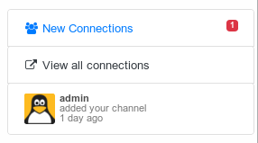
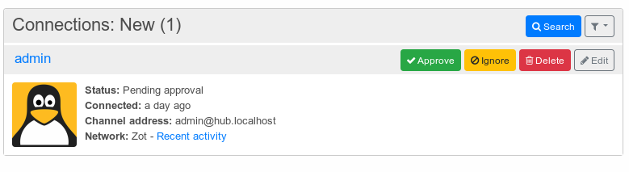

# Connections

<!-- TOC depthFrom:1 depthTo:6 withLinks:1 updateOnSave:1 orderedList:0 -->

- [Connections](#connections)
	- [Finding connections](#finding-connections)
	- [Connect with other Hubzilla channels](#connect-with-other-hubzilla-channels)
	- [Editing connections](#editing-connections)
		- [Privacy groups](#privacy-groups)
		- [Individual permissions](#individual-permissions)
		- [Connection tools](#connection-tools)
	- [Connections](#connections)
	- [Accepting connections](#accepting-connections)
	- [Deleting Connections](#deleting-connections)
	- [One side connections](#one-side-connections)
	- [Invite friends](#invite-friends)
		- [Connecting to Premium channels](#connecting-to-premium-channels)
	- [Connect with channels on other networks](#connect-with-channels-on-other-networks)
		- [Connect with RSS feeds](#connect-with-rss-feeds)

<!-- /TOC -->

Connections in Hubzilla can take on a great many different meanings. A connection is more accurately defined as a set of permissions that you have granted to somebody else. In traditional social network applications, all connections are granted the same permissions; or at most there two levels (friends and 'followers'). In Hubzilla a range of separate permissions may be set/adjusted depending on the situation and relationship you have with the other channel. You can allow somebody to view your posts but not your photos. You can also deny them permission to comment on your posts or send private mail to you. But let's keep it simple, you want to be friends with somebody like you are familiar with from social networking. How do you do it?

## Finding connections
First, you need to find some channels to connect to. There are two primary ways of doing this. Firstly, setting the "Can send me their channel stream and posts" permission to "Anybody in this network" will bring posts from complete strangers to your matrix. This will give you a lot of public content and should hopefully help you find interesting, entertaining people, forums, and channels.

The next thing you can do is look at the Directory. The directory is available on every Hubzilla website which means searching from your own site will bring in results from the entire network. You can search by name, interest, location, and keyword.

If you already know somebody's 'webbie' you can connect with them directly. A webbie looks just like an email address (for instance bob@example.com) but refers to somebody in the open social web. In order to connect they must be using a compatible network protocol. By default, this software supports the 'zot' protocol, however additional protocols may be provided through plugins/addons. See below for more information on connecting to channels on other networks.    

## Connect with other Hubzilla channels

Visit their profile by clicking their photograph in the directory, grid or comments, and it will open their channel home page in the channel viewer. At the left hand side of the screen, you will usually see a link called "connect". Click it, and you're done.


Depending on the settings of the channel you are connecting to, you may need to wait for them to approve your connection, but no further action is needed on your part. Once you've initiated the connection, you will be taken to the connection editor. This allows you to assign specific permissions for this channel if you wish to make any changes.

If you found the connection in the directory you also could connect directly without visiting the profile:


At last you may also connect with any channel by visiting the "Connections" page of your site or the Directory and typing their "webbie" into the "Add New Connection" field.


Use this method if somebody tells you their webbie and you wish to connect with them. The process is the same as connecting via the "Connect" button - you will then be taken to the connection editor to set permissions.

## Editing connections
After you made a new connection you are directly taken to the connection editor.


If you want to edit existing connections you can call the connection editor from the connection overview page (see below).

In the connection editor you can set the individual permissions for this connection, assign the connection to one or more privacy groups, refresh the connection information or change its connection status.

### Privacy groups
On the left side of the connection editor your privacy groups are listed. Privacy groups allow you to conveniently share items with groups of people.

To assign the connection to one or more privacy groups you simply have to check them.

You can create whatever groups fit your needs by opening the Add privacy group link.

### Individual permissions
Granting of permissions is usually automatic and requires no action on your part. However you may wish to adjust specific permissions for this connection which are different than for others.


Here you can see all possible permissions your connection has. Also you can compare your permission settings and the permission settings of your connection.

Some permissions may be inherited from your channel's privacy settings, which have higher priority than individual settings. You can not change those settings here.

For a better understanding of permissions have a look at the concepts.

### Connection tools
With the connection tool you can refresh the connections vcard, permissions or profile photos.

The vcard is only fetched when requested. Permissions and photos occasionally do not get updated if there are network issues so you can force a refresh. Normally these are not needed - but we're in a decentralised world where things like site outages and cert failures happen.

**If you edited the vcard and fetch the information again all local changes will be overridden**

Furthermore you can change the status of your connection or completely delete it.


Channels in your address book can have statuses such as blocked, ignored, archived and hidden. From your connections page you can see tabs that display the channels with those statuses. From your edit connection pages you can change the statuses of a channel.

Following status are possible for a connection:

| Status   | Description                                                 |
|----------|-------------------------------------------------------------|
| Blocked  | All communications with this connection are blocked. The connection can't read your items regardless of permissions, nor can it write to your channel.        |
| Ignored  | All inbound communications from this connection are ignored. The connection can read your items if it has permission, but can't write to your channel. |
| Archived | The connection is marked dead but its content will be kept. If a channel can't be reached for 30 days, it is automatically marked as archived. This keeps all the data but stops polling the channel for new information and removes it from autocomplete. If later you learn the channel has come back online, you may manually unarchive it.
| Hidden   | The connection is hidden from the other connections. The connection does not show up in your profile's connections list, no one can see you're connected, but beware they may still show up to your other connections, for example in post replies.         |


## Connections
You can get to an overall view of your connections by calling the connections app:


The connection app provides an overall view of all of your connections and their basic information like when you connected them, their channel address and the type of network they belong to.

Clicking on the connection name gets you to the original profile of the connection and "Recent activity" shows you a stream of the connection publications.


Here you can filter your connections either by the connection status or by the belonging to a privacy group. Furthermore you can open the connection editor for each connection.

## Accepting connections
When somebody added your channel as a connection you will receive a notification (if you enabled this in your notification settings which is recommended).



Clicking on the notification or calling the connection app will show you your new connections:



When you directly go to the connection editor by clicking the edit button you will first have to approve the connection before editing the individual permissions.

Approving simply adds the request to your connections.

## Deleting Connections
You can delete a connection directly from the connection overview or from the connection editor


After you confirmed the deletion the connection will be removed from your addressbook.

## One side connections
As long as your connection has not been approved by the other side your connection is one-sided.
You can see if one of your connection is only one-sided at the individual profile page or at the connections overview. The profile photos are marked by a "no-entry" sign:


The no-entry sign appears as long as your connection has not be confirmed by the other side or when your connection deleted you from his addressbook.

The no-entry sign doesn't appear if you are blocked or ignored. But you can discover if you are blocked or ignored by having a look at the delivery report of a post or comment. In such a case your post/comment wasn't delivered.

## Invite friends
Additional to adding new connections you can invite friends to join you on your hub. Therefore simply call the invite app from the connections app:


This will lead you to the send invitations page:


Here you can add several email addresses to send your invitations to and edit the invitation message.

If your hub requires an invitation code to register the code is automatically included into the message.

Please don't change the invitation code by hand because.

### Connecting to Premium channels
Some channels are designated "Premium Channels" and may require some action on your part before a connection can be established.


The Connect button will for these channels will take you to a page which lists in detail what terms the channel owner has set. If the terms are accepted, the connection will then proceed normally. In some cases, such as with celebrities and world-reknowned publishers, this may involve payment. If you do not agree to the terms, the connection will not proceed, or it may proceed but with reduced permissions allowed on your interactions with that channel.

## Connect with channels on other networks
The process for connecting to channels on other networks (such as GNU-Social, Mastodon, and Diaspora) is similar - type their "webbie" into the "Add New Connections" box on the "Connections" page.

Before you do this however, please visit your Settings page (Feature/Addon Settings) and ensure that the relevant protocol (Diaspora, GNU-Social/OStatus, or ActivityPub) is provided on your hub and activated for your channel.

**These networks/protocols do not support account migration and location independence so if you move location or clone your channel elsewhere, communications with these connections may fail.**

For this reason these protocols are not activated by default, but only through your consent. Activating these protocols involves an important decision between communicating with friends on these networks or providing fail-safe account resilience if your server fails.    

Some communications offer more than one protocol. If you wish to connect with somebody on Mastodon (for instance) they can use either the 'ostatus' or the 'activitypub' protocol for communication. Generally the 'activitypub' protocol will provide a better experience than 'ostatus', but Hubzilla will often choose the first protocol it discovers and this may not be the one you want. You may connect with somebody over a specific protocol by prepending the protocol name in square brackets to their "webbie". For example

```
[activitypub]https://foo.bar/foobar
[ostatus]foobar@foo.bar
[diaspora]foobar@foo.bar
[zot]foobar@foo.bar
[rss]https://foo.bar/foobar
```

Connections to Friendica work via the Diaspora protocol.

In order to use one of these protocols (beside Zot) your hub admin must have activated them and you have to make sure that you also enabled the corresponding protocol for your channel. The individual protocol settings can be found under your Addon Settings:


A detailed description of each protocol can be found at the plugins-help.

### Connect with RSS feeds
Your hub admin may allow connecting to RSS feeds. The process for connecting to an RSS feed is the same, except type (or paste) the URL of the feed into the "Add New Connection" box. Feeds are only processed once or twice per day and your hub admin may impose limits on how many feeds you may add. Apart from this you can handle a RSS feed connection as a usual connection.
