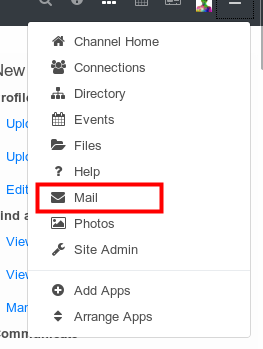
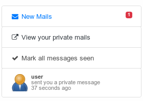
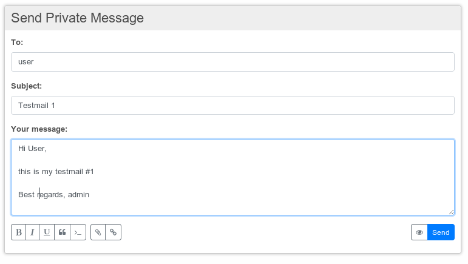
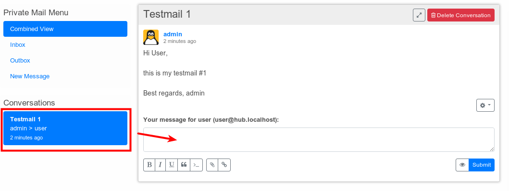
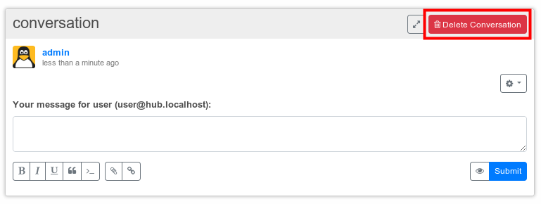

# Private Mail

Hubzilla has a private mail system which can be used to send private messages to other hubzilla members or even to connections at Friendica or Diaspora.

The messages displayed in private mail are visible only to you and the single recipient.
If a connection can send you private messages depends on your security settings, i.e. your permission category or the individual permissions you set for a connection. See at
[Connections](./connections.md) for more information on the last topic.

Private mail is stored in an obscured format. While this is not bullet-proof it typically prevents casual snooping by the site administrator or ISP.  

Each Hubzilla channel has it's own unique set of private and associated public RSA 4096-bit keys, generated when the channels is first created. This is used to protect private messages in transit.

You can open your private mail by calling the mail app from your app tray or directly use the URL https://yourhost/mail/

## Reading Mail

You can choose between three different view modes in the mail app:

The combined view, inbox and outbox.
While inbox and outbox simply display only one received or sent message the combined view displays a complete conversation in a continuous thread.

When you receive a new private mail you will get a notification (must be enabled in your channel settings)

By clicking on this notification you will directly be led to the message and the notification will be marked as seen.

## Sending a private message
You start composing a new private message simply by clicking on the "New Message" link in your mail app

Here you can select your recipient, enter a subject and edit your message. Formatting works the same way as for [sharing content](./sharing_content.md) so help can be found there.

Sending mail to more than one recipient is not possible.

After submitting your message you can easily sent further messages in the same context after selecting your mail from the combined view or outbox

For each individual message you've sent you can view it's delivery report, delete it or recall it. While deleting only deletes the single message on your server, recalling it also deletes it from the server of your recipient which is no guarantee that your recipient didn't already read your message.

**Recalling messages is only possible for messages between Hubzilla channels.**

You can also delete the whole conversation at once, but only from your server:

