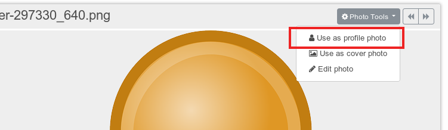
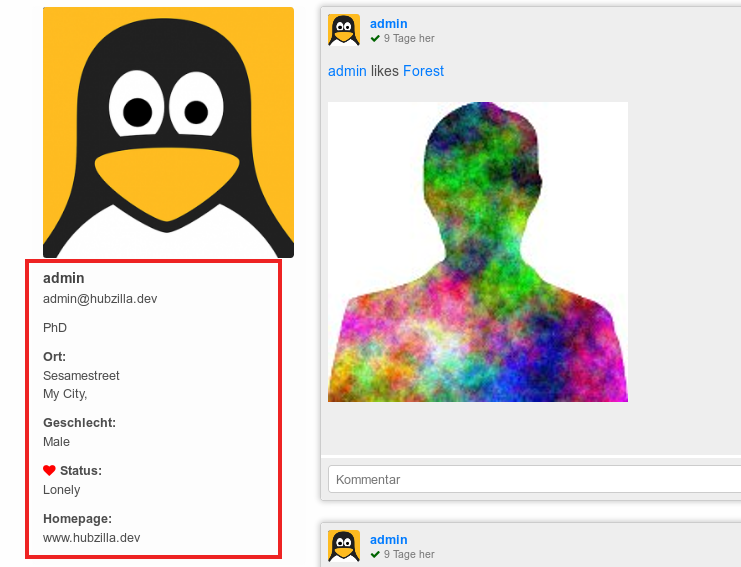
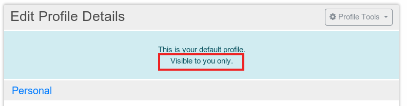

# Profiles
Each channel has at least one profile which typically contains information describing the channel. If the channel represents a person in a social network, for example, then the profile might provide contact information and other personal details about the person.

You always have a profile known as your "default" or "public" profile. This profile is always available to the general public and cannot be hidden (there may be rare exceptions on privately run or disconnected sites). You may, and probably should restrict the information you make available on your public profile.

That said, if you want other friends to be able to find you, it helps to have the following information in your public profile:

- Your real name or at least a nickname everybody knows
- A photo of you
- Your location on the planet, at least to a country level.

In addition, if you'd like to meet people that share some general interests with you, please take a moment and add some "Keywords" to your profile. Such as "music, linux, photography" or whatever. You can add as many keywords as you like.

Channels can have multiple profiles, where the displayed profile depends on the observer. More about multiple profiles can be found in the feature section.

## Edit profile
There are several possibilities to start editing your profile.
You can use the edit profile menu

or you can use one of these two buttons if you are already watching your profile:

Here you may edit an existing profile, change the profile photo, add things to a profile.

Your profile details are divided into five major sections
- personal information: what's your name, when is your birthday etc.
- contact information in v-card format: (e-mail, phone number and messenger), which can be exported by the viewer of your profile and imported into a corresponding program
- location: where do you live, which street, town ...
- relation: are you in a relation? What are your sexual preferences?
- miscellaneous: everything else, some free text fields

If you want more profile information fields and more possibilities to choose from, i.e. your "sexual preferences", simply enable "advanced profiles" in your additional features. Which advanced profile fields will are included by the advanced profiles depends on your hub installation respectively your hub administrator.

See additional features for more information on [advanced profiles.](../../feature/advanced_profiles.md)

## Profile photo
You can change your profile photo by using the corresponding profile tool

You can choose between uploading a new photo as your profile picture or using selecting a photo from your photo albums.

### Upload new profile photo
If you want to upload a new photo you first have to select your file and upload it afterwards.

After uploading your photo you will be redirected to the cropping image screen:

In this screen you can adjust the image cropping as you like it. A preview of your cropped image is visible below. When you are happy with your result click the "done editing" button at the bottom of the screen and you will be redirected to your profile page:

If you can't see your new photo here you might need to clear your browser cache.

When you changed your profile photo a new post will automatically be posted to notify others

### Choose photo from photo album
If you decide to use an existing photo as your profile photo you will be redirected to your photo albums:

Here you can navigate through your photo albums or simply choose one of your recent photos.

After you opened your photo by clicking on it you can set it as your new profile photo by using the corresponding photo tool:

After that you will be redirected to the cropping image screen and everything works as described in the section above.

How to change profile photos for multiple profiles is covered in the help about multiple profiles.

## Cover photo
The second profile tool that is available to you is the "change cover photo" tool.
The cover photo is displayed not on your profile page but on your channel page. So everyone visiting your channel will see your cover photo first:

When scrolling down your cover photo will disappear above and your menu and channel postings will be visible.

Changing the cover photo works the same way as the "change profile photo" tool. You can choose between an existing photo from your photo albums or choose to upload a new photo.

After you have decided which photo you take you will be taken to the cropping image scene. The only difference regarding cropping the profile photo is in the aspect ratio. As the cover photo will be displayed on top of your channel it will have a rectangular form.

Once again conform your selection by clicking the "Done Editing" button and you will be redirected to your channel with your new cover photo.

As with the profile photo a post will automatically be created to notify others that your cover photo has changed.

## Add profile things
Additional to the standard profile information you can add more information about yourself. This is done by adding profile things using the corresponding profile tool in your profile editor.

Tell us what you've got, want, like or dislike. Just enter the name of the thing and add an URL or an URL for a photo of the thing.

You can decide if there will be a post about your new profile thing or not and who can see this thing when looking at your profile.

After you submitted your "thing" you can directly add another one.

Things are visible on your profile screen and displayed directly below your standard profile information and can be liked by others:

By clicking on the photo you will be redirected to the URL of the thing.

You can edit your "thing" afterwards is also possible by clicking on the thing name. Here you can choose to delete the thing or edit your settings.

## Who can see my profile? How can I set restrictions?
As told above you have at least one "default" or "public" profile per channel which is visible to anybody on the internet. The information of your profile are displayed at your profile page and a part of your profile information on your channel home:

Furthermore your profile can be published to a directory so it can be found by others. If your profile will be published to a directory depends on your channel permission category. For example if your channel permission category is set to "social - mostly public" your profile will be listed in the directory. If your channel permission is set to "social - private" your profile will not be listed in the directory. And if you chose the "custom/expert mode" as your channel permission category there will be an extra option to publish your default profile to the directory.

More about directories can be found at the feature description about [directory services.](../../feature/directory_service.md)

If you do not wish to be found be people unless you give them your channel address, you may leave your profile unpublished.

If this option is not visible to you your hub admin may enabled the setting that
all profiles on this site have to be listed in the directory independently of your channel permission setting.

The only possibility to make your default profile invisible to the internet is by using the "custom/expert mode" in your channel permission category. If you use this category you have the possibility to select who can view your default profile. Anybody else will only see your profile picture and your profile name.

Who can see your profile can be seen when you edit your profile:

The visibility shown here corresponds your selection for your channel permission limit regarding your profile.

If you want a more refined approach to share and restrict profile information amongst different groups of connections have a look at the [multiple profile feature.](../../feature/multiple_profiles.md)
