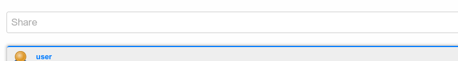
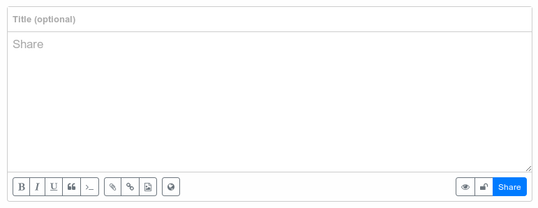

# Sharing content

Sharing content can easily be done from your channel home or the activity view. Of course there are some more ways to share content but this will be explained elsewhere.

To start sharing simply click into the little share area of your channel home or activity view:

 

After clicking the share area gets expanded:

Each post can have a title which is optional and obviously some content.
Below the content pane you can find different button groups.

The buttons to the left are used for formatting your text. As usual you can use bold fonts, italics and underlines. Furthermore you can have an extra block for citations or code snippets.

It's not a wysiwyg-Editor so when you click on one of these buttons the corresponding bb-block-starting end ending elements will be inserted into the content pane.

Public messages are generally not encrypted in transit or in storage.  

Private messages may be retracted (unsent) although there is no guarantee the recipient hasn't read it yet.

Posts and messages may be created with an expiration date, at which time they will be deleted/removed on the recipient's site.  

## Delivery report
Blocked - permission denied
Ignore - permission denied
