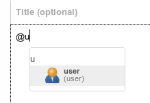
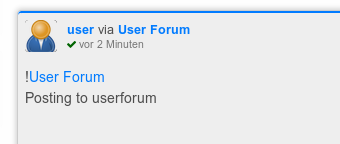

# Tags and mentions

Like many other platforms, Hubzilla uses a special notation inside messages to indicate "tags" or contextual links to other entities.

## Mentions
Channels are tagged by simply preceding their name with the ``@`` character.

```
@Jack
```
When you start to mention somebody, it will create an auto-complete box to select from your immediate connections. Select one as appropriate.



If the person mentioned is in the list of recipients for the post, they will receive a tag notification.  

You cannot mention channels you are not connected to.

## Deliverable Mentions

The `!` character designates a deliverable mention to a forum or special channel which allows "re-delivery of mentions".

While the following simply mentions the Gardening forum
```
@Gardening
```

using the ``!`` character like in
```
!Gardening
```
also mentions the Gardening forum and also sends the post to all the forum members.

This deliverable mention can be identified by the "via" keyword in the heading of a post. So the following post was published to you by user via the User Forum:



In order to use this forwarding the forum must have the right "can forward to all my channel connections via @+ mentions in posts" activated. This is not restricted to forums. You can also give this permission to individual connections.

Note: In previous releases, forums were delivered by using @forum+ with a plus sign at the end. This mechanism is still used occasionally but is deprecated and !forum is now preferred.

## Private Mentions
If you wish to restrict a post to a single person or a number of people, you can do this by selecting channels or privacy groups from the privacy tool.

You can also just tag them with a privacy tag. A privacy tag is a name preceded by the two characters `@!` - and in addition to tagging these channels, will also change the privacy permissions of the post to only include them.

You can have more than one privacy tag, for instance ``@!bob`` and ``@!linda`` will send the post only to Bob and Linda. This mechanism over-rides the privacy selector.  

You may also tag privacy groups which are "public". When you create or edit a privacy group, there is a checkbox to allow the group members to be seen by others. If this box is checked for a group and you tag (for instance) ``@!Friends`` - the post will be restricted to the Friends group. Check that the group is public before doing this - as there is no way to take back a post except to delete it. The group name will appear in the post and will alert members of that group that they are members of it.    

## Mentions and Comments
The above mechanisms only apply to "top-level" posts you create. Mentioning a channel with any of the above mechanisms has no effect in comments, except that the mentioned channel may receive a notification if they were already included as a recipient in the conversation.

## Topical Tags
Topical tags are indicated by preceding the tag name with the  ``#`` character. This will create a link in the post to a generalised site search for the term provided. For example, ``#cars`` will provide a search link for all posts mentioning 'cars' on your site.

Topical tags are generally a minimum of three characters in length.  Shorter search terms are not likely to yield any search results, although this depends on the database configuration.

They are also not linked if they are purely numeric, e.g. ``#1``. If you wish to use a numeric hashtag, please add some descriptive text such as #2012-elections.

Tagging is not limited to your own posts. It is also possible to tag posts of others as long as you are allowed to. Allowing others to tag your posts can be enabled in the security and privacy section of your channel settings.

## Spaces in Tags and Mentions
Where possible please use the auto-complete window to select tag and mention recipients, because it will generate a coded tag which uniquely identifies one channel. Names are sometimes ambiguous. However, you can "manually" tag a channel by matching the channel name or address.

For example
```
@Robert Johnson
```

will tag Robert Johnson, but we can only match one space. If the name was "Blind Lemon Jefferson" it won't be found unless you enclose the entire name in double quotes or change the spaces to underscores.

So both of the following mentions are equivalent.  

```
@"Blind Lemon Jefferson"
@Blind_Lemon_Jefferson
```
